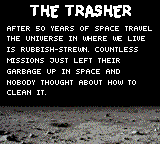
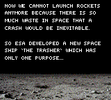
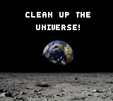
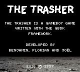

# The Trasher
The Trasher is a gameboy game written with the GBDK framework. It is developed by a group of FHNW students for the subject sdent.

## Story
After 50 years of space travel the universe in where we live is rubbish-strewn.
Countless missions just left their garbage up in space and nobody thought about how to clean it.

Now we cannot launch rockets anymore because there is so much waste in space that a crash would be inevitable.

So ESA developed a new space ship `The Trasher` which has only one purpose. To clean up the universe!
 
## Impressions

### Mockups

*Mockups*

### Screens

## About
Developed by

* Benjamin
* Joël
* Florian

FHNW 2016